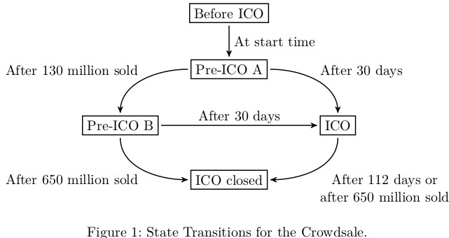

## Cointed Token (CTD) and Token Sale

**General Overview**

Token Name|Cointed Token (CTD)
---|---
Decimals|18
Smallest Unit (Atom)|1e-18 CTD
Token Amount|Up to 650,000,000 CTDs `(#1)`
Token Price|Fixed to 1000-1150 CTDs/ETH `(#3)`
Percentage for sale|100%
Minimum Token Purchase|1 Wei
Maximum Token Purchase|No Limit
Minimum Funding Goal|None
Refund|Yes (`#5)`
Owner Rewards|Yes `(#3)`
Extra Features|Pausable, Upgradable, Owner Limits . . . `(#6)`

**1. Token Amount**

The maximum token amount is 650 million CTDs.
Tokens are minted during the crowdsale and the total supply is fixed at the end of the crowdsale so that the maximum token amount might not be reached.
In case the maximum number should be reached, the crowdsale allows for up to 1,514 atoms to be created due to arithmetic imprecisions.

**2. ICO Phases**

The token sale goes through the following phases:

1. Before the ICO: Allows the owner to perform contract setup
2. Pre-ICO A: Phase with 15% bonus
3. Pre-ICO B: Optional phase with 10% bonus
4. ICO: Regular ICO Phase
5. After the ICO: All payments are refunded `(#5)`

The phase transitions are displayed in Figure 1.
They can either happen due to elapsed time or as a certain number of tokens has been purchased.

**3. Phase change rewards**

There are special phase change rewards.

- The first token buyer during the Pre-ICO A phase receives 0.1 ETH
- If the Pre-ICO A phase sells out, the final token buyer receives 0.1 ETH
- If the ICO phase is entered, the first token buyer receives 0.2 ETH
- If the Pre-ICO B phase or the crowdsale is sold out, the last token buyer receives 0.5 ETH

These rewards have to be claimed in the same way as refunds `(#5)`.

**4. Token Prices:**

The token buyer receives the following amount of tokens in the phases per ETH:

Phase|Token Buyer|Owner|Bounty
---|---|---|---
Pre-ICO A|1150|304|61
Pre-ICO B|1100|292|58
ICO|1000|263|52

As the table shows, with each token purchase additional tokens are minted for the owner and the bounty account.

**5. Refund Options**

Refunds can occur in the following situations:
- A token purchase at the end of a phase might get partially refunded for those funds
which exceed the phase limit. ⇒ Partial Refund
- A token purchase after the ICO completion. ⇒ Full Refund

As the contract has no minimum funding goal, no token purchases can be refunded.

Refunds are not directly send back, but must be withdrawn using the `withdraw` function.

Token buyers are notified of a pending withdrawal with the `Withdrawal` event.

These refunds cannot be accessed by the owner for 30 days after the completion of the ICO.
Afterwards, the owner can withdraw unclaimed refunds using the `returnWei` function.

**6. Extra Features**

_Pausable_

The owner has the power to pause the token sale and/or circulation once for the duration of two weeks.
During this time no token transfers, token purchases or refunds can be made.

_Upgradable_

The owner can propose a token upgrade to a new token version. This can happen at any time.

Individual token owners can accept the upgrade by calling the upgrade function.

_Owner Limits_

The contract limits the owner’s power during the ICO.
During the ICO the contract owner cannot transfer any tokens.

_Safe Defaults_

Should the owner fail to perform a proper setup before the start of the token sale, then the contract will automatically assign its owner to critical functions.

### Bug Bounty Program

$ `sha256sum contracts/*.sol` 
`3dc564c3fac6de6bd0c21d437400c489375dc5098353057c2e5ea74730d8f9ef  CtdToken.sol` 
`f3c312a90c3b4d2c4b19d50c171b54917f083f8d0ae446206dd64233600627dc  InterfaceUpgradeAgent.sol` 
`ab900efc07d968b2eba5579f555505205500b7156a5e8cd1622a7a7b42486d2b  PausableOnce.sol` 
`2fe1dfeec7fd85c6d071b36c25509fe2e94a3fc86c68640400b555eb3bb7235e  UpgradableToken.sol` 
`cc25f011784254b7e0e9c1dc5667cf5da37ce06d1c1148299fd6ed70b97c37d5  Withdrawable.sol` 

... details soon follow...

#### Setup and tests

**tests** 
$ `truffle test`

**lint** 
$ `solium --dir contracts`
 
**pre-requisits:**

$ `sudo npm i -g truffle`  
$ `sudo npm i -g ethereumjs-testrpc`  
$ `sudo npm i -g solium`  
$ `npm install`  

_Bash scripts from ./script may be helpful._
